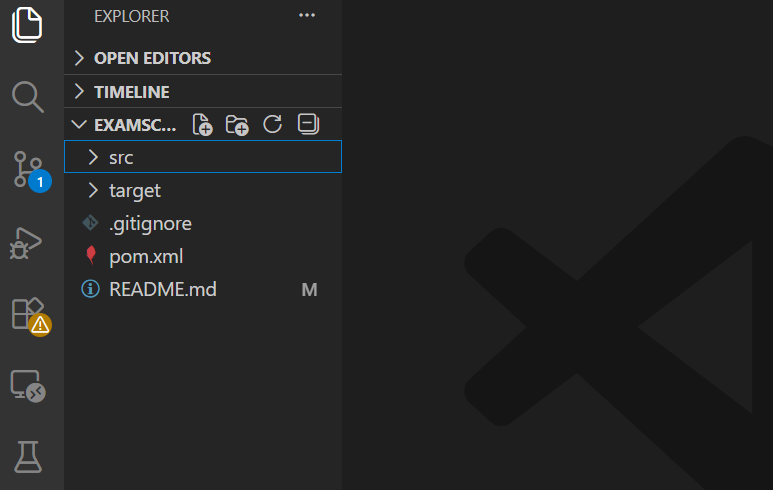
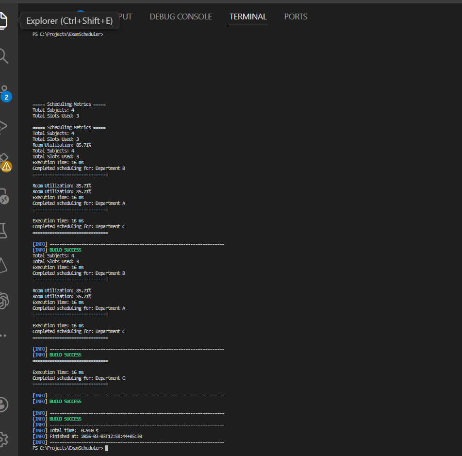

# Smart Exam Scheduling System

## Overview

A multithreaded exam scheduling system built using Java and Maven.

This system simulates real-world university exam scheduling using graph coloring and resource allocation strategies.

---

---

## Project Structure



---

## Sample Output




## Architecture

Browser/Client
      ↓
SchedulingTask (Multithreading Layer)
      ↓
SchedulerEngine
      ↓
ConflictGraph + GraphColoring + RoomAllocator


## Sample Input

students.txt:
S1:Math,Physics
S2:Math,Chemistry
...

rooms.txt:
R1:2
R2:2
R3:3

## Features

- Conflict graph generation (Adjacency List)
- Optimized Graph Coloring (Highest Degree First heuristic)
- Slot-aware Room Allocation
- Capacity constraint handling
- Multithreaded scheduling simulation using ExecutorService
- Performance metrics (execution time, slot usage, room utilization)
- File-based input loading (classpath resources)
- Clean layered architecture (model, service, util)

---

## Tech Stack

- Java 21
- Maven
- Graph Algorithms
- Greedy Heuristic
- ExecutorService (Concurrency)
- OOP Principles

---

## How to Run

```bash
mvn clean
mvn compile
mvn exec:java -Dexec.mainClass=com.exam.main.ExamSchedulerApp
```
